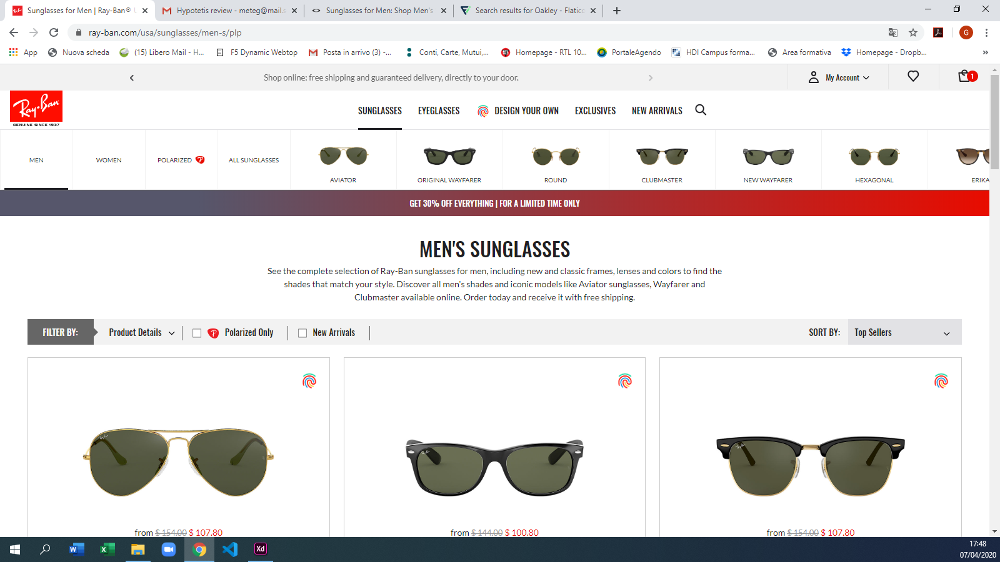
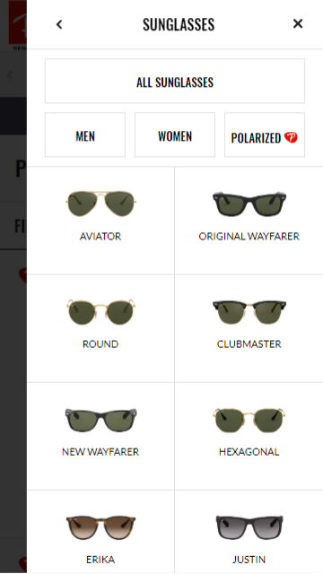
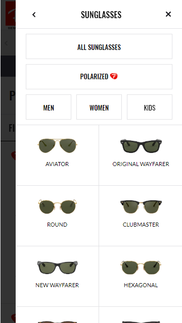
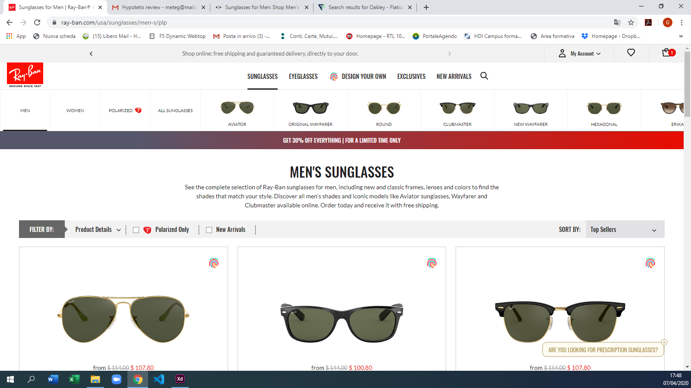
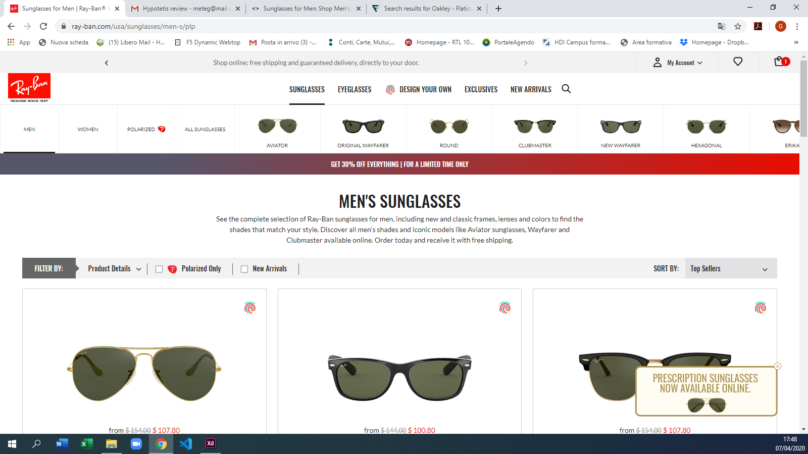
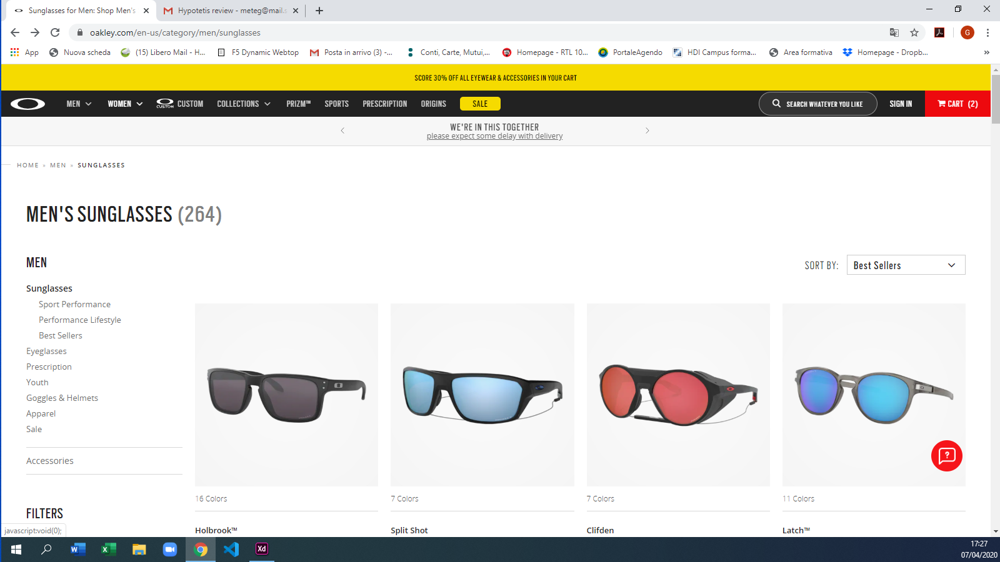
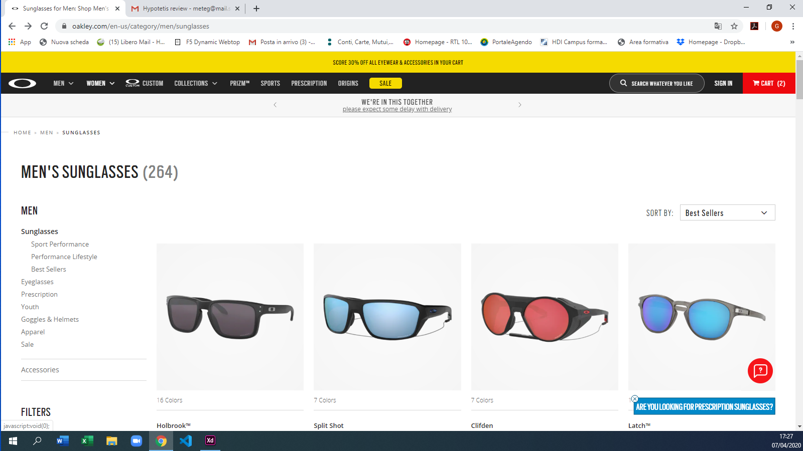
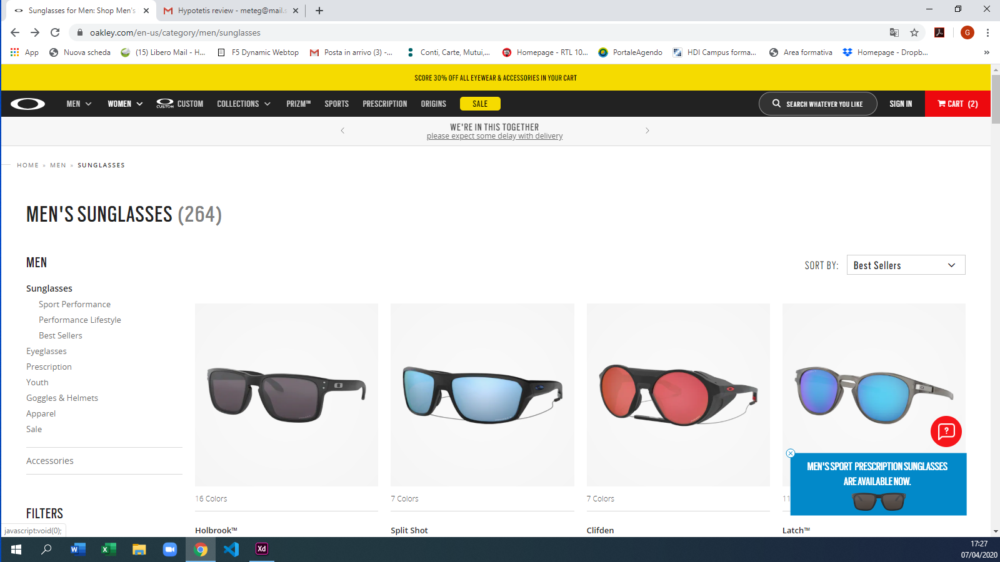
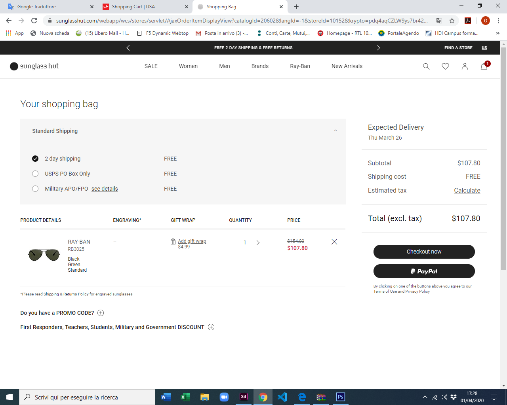
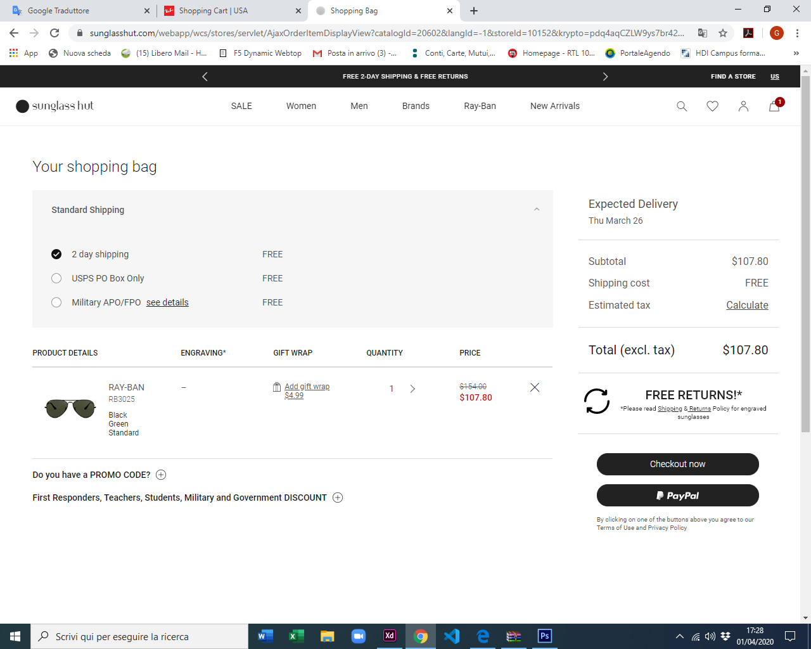

# Fog
Repository for FOG TEAM

---

## RB - "Kids" menu item hidden

### For desktop

We need to change the position of the navigation.

#### Before

#### After

Steps to achieve this:
- Select the element
- Add CSS with jQuery

Example code

    $("nav_item").css("order", "-1");

### For Mobile

- We need to change the position of the navigation.
- We need to set the style of "kids" and "polarized" menu items

#### Before

#### After

Steps to achieve this:
- Select the element
- Add CSS with jQuery
- Add and Reove CSS classes with jQuery
- Fix the borders and make it responsive

Example code

    $("nav_item").css("order", "-1");
    $("nav_item").css("margin", "20px");
    $("nav_item").addClass("BigButton");
    $("nav_item").removeClass("SmallButton");
    $( window ).resize( function() {
        $("nav_item").css("margin", "10px");}

### JS file
https://spd-master-web.github.io/Fog/RB-Kids_menu_item/RB-Kids_menu_item.js

---

## RB - Prescription sunglasses popup

We need to add the hover popup in a bottom-right corner

#### Before

#### After

Steps to achieve this:
- Create the banner HTML 
- Add CSS 
- Create jQuery function for the hover effect
- Add all into the document with the .append() jQuery API

Example code for the hover

    $(document).on("mouseenter","popup", function(event)){
        do something...
    }).on("mouseover","popup", function(event)){
        return as before...
    })

Example code for the append
    
    $("body").append("
        
        
...

        )

#### HTML test file
https://spd-master-web.github.io/Fog/RB-Prescription_banner/popup.html

#### JS file
https://spd-master-web.github.io/Fog/RB-Prescription_banner/popup.js

## OO - Prescription sunglasses popup

We need to add the hover popup in a bottom-right corner

#### Before

#### After

Steps to achieve this:
- Create the banner HTML 
- Add CSS 
- Create jQuery function for the hover effect
- Add all into the document with the .append() jQuery API

Example code for the hover

    $(document).on("mouseenter","popup", function(event)){
        do something...
    }).on("mouseover","popup", function(event)){
        return as before...
    })

Example code for the append
    
    $("body").append("
        
        
...

        )

#### HTML test file
https://spd-master-web.github.io/Fog/OO-Prescription_popup/popup.html

#### JS file
https://spd-master-web.github.io/Fog/OO-Prescription_popup/popup.js

## SGH - Free reuturns info on Cart page

We need to add a little section that remember the free reurns to the user under the costs column

#### Before

#### After

Steps to achieve this:
- Create the label with HTML 
- Add CSS 
- Add all into the document with the .after() jQuery API
- Move the Policy in the new section

Example code for the append
    
    $("#total").after("
        
        
...
");
    $("new_place").after("policy");

#### HTML test file
https://spd-master-web.github.io/Fog/SGH-Free_returns/freereturn.html

#### JS file
https://spd-master-web.github.io/Fog/SGH-Free_returns/freereturn.js

