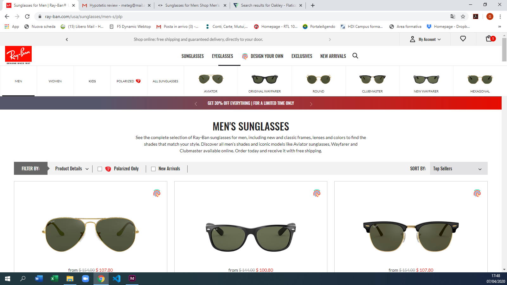

# Fog
Repository for FOG TEAM

---

## RB - "Kids" menu item hidden

### For desktop

We need to change the position of the navigation.

#### Before

#### After

Steps to achieve this:
- Select the element
- Add CSS with jQuery

Example code

    $("nav_item").css("order", "-1");

### For Mobile

- We need to change the position of the navigation.
- We need to set the style of "kids" and "polarized" menu items

#### Before

#### After

Steps to achieve this:
- Select the element
- Add CSS with jQuery
- Add and Reove CSS classes with jQuery
- Fix the borders and make it responsive

Example code

    $("nav_item").css("order", "-1");
    $("nav_item").css("margin", "20px");
    $("nav_item").addClass("BigButton");
    $("nav_item").removeClass("SmallButton");
    $( window ).resize( function() {
        $("nav_item").css("margin", "10px");}

### JS file
https://spd-master-web.github.io/Fog/RB-Kids_menu_item/RB-Kids_menu_item.js

---

## RB - Prescription sunglasses popup

We need to add the hover popup in a bottom-right corner

#### Before

#### After

Steps to achieve this:
- Create the banner HTML 
- Add CSS 
- Create jQuery function for the hover effect
- Add all into the document with the .append() jQuery API

Example code for the hover

    $(document).on("mouseenter","popup", function(event)){
        do something...
    }).on("mouseover","popup", function(event)){
        return as before...
    })

Example code for the append
    
    $("body").append("
        
        
...

        )

#### HTML test file
https://spd-master-web.github.io/Fog/RB-Prescription_banner/popup.html

#### JS file
https://spd-master-web.github.io/Fog/RB-Prescription_banner/popup.js

---

## RB - Cosutomization button on top

We need to move the customization button on top of the shop button

#### Before

#### After

Steps to achieve this:
- Remove some space
- Make the container flex
- Set the order

Example code for the hover

    $(space).css("display","none");
    $(container).css("display","flex");
    $(size).css("order","0");
    $(shop.css("order","2");

#### JS file
https://spd-master-web.github.io/Fog/RB-Customization_on_top/RB-Customization_on_top.js

---

## OO - Prescription sunglasses popup

We need to add the hover popup in a bottom-right corner

#### Before

#### After

Steps to achieve this:
- Create the banner HTML 
- Add CSS 
- Create jQuery function for the hover effect
- Add all into the document with the .append() jQuery API

Example code for the hover

    $(document).on("mouseenter","popup", function(event)){
        do something...
    }).on("mouseover","popup", function(event)){
        return as before...
    })

Example code for the append
    
    $("body").append("
        
        
...

        )

#### HTML test file
https://spd-master-web.github.io/Fog/OO-Prescription_popup/popup.html

#### JS file
https://spd-master-web.github.io/Fog/OO-Prescription_popup/popup.js

---

## OO - Prescription sunglasses popup

We need to add the colors thumbnails also in mobile

#### Before

#### After

Steps to achieve this:
- Learn how the thumbnails are on Desktop:
    On desktop the thumbnails are formed by 'href' item, inside a div .owl-item, all thumbnails for each product are inside a list div
    1. .owl-wrapper 
    2. .owl-wrapper-outer
    3. .colors-carousel_items
    4. .colors-carousel
- Learn how is formed the Mobile page:
    in the mobile HTML page for each product, are present the list of 'href' thumbnails directly inside .colors-carousel_items div, with display:none, 
    and also .colors-carousel_items div has a property display:none.

- Insert the single thumbnail inside .owl-item div
- Insert the list of thumbnail for each product inside the .colors-carousel_items and .colors-carousel divs
- fix the all properties like display, background, and overflow (to make scrollable the thumbnails list).

- On thumbnail click change the main product picture and price

- On button click to see other product wait for the charging and redo the function

Example code 
    
    $("a.thumbnail").wrap("
");
    $("product").each({
        $('.owl-item').wrapAll("

")
    })
    $(".owl-wrapper").css("...)
    $(".owl-wrapper-outer").css("...)
    $(".colors-carousel_items").css("...)
    $(".colors-carousel").css("...)

    $(a.thumbnail).on(click, function(){
        new_price=$(a.thumbnail).attr(price)
        new_img=$(a.thumbnail).attr(img)
        new_link=$(a.thumbnail).attr(link)
        $("product").find("primary_img").css(background, new_img)
        $("product").find("primary_img").attr(href, new_link)
        $("product").find("price").text(new_price)
    })

    $("button").on(touchend, function(){
        setTimeout(function(){ redo(); }, 3500);
    })
    

#### JS file
https://spd-master-web.github.io/Fog/OO-thumbnails_on_PLP_mobile/OO-thumbnails_on_PLP_mobile.js.js

---

## SGH - Free reuturns info on Cart page

We need to add a little section that remember the free reurns to the user under the costs column

#### Before

#### After

Steps to achieve this:
- Create the label with HTML 
- Add CSS 
- Add all into the document with the .after() jQuery API
- Move the Policy in the new section

Example code for the append
    
    $("#total").after("
        
        
...
");
    $("new_place").after("policy");

#### HTML test file
https://spd-master-web.github.io/Fog/SGH-Free_returns/freereturn.html

#### JS file
https://spd-master-web.github.io/Fog/SGH-Free_returns/freereturn.js

